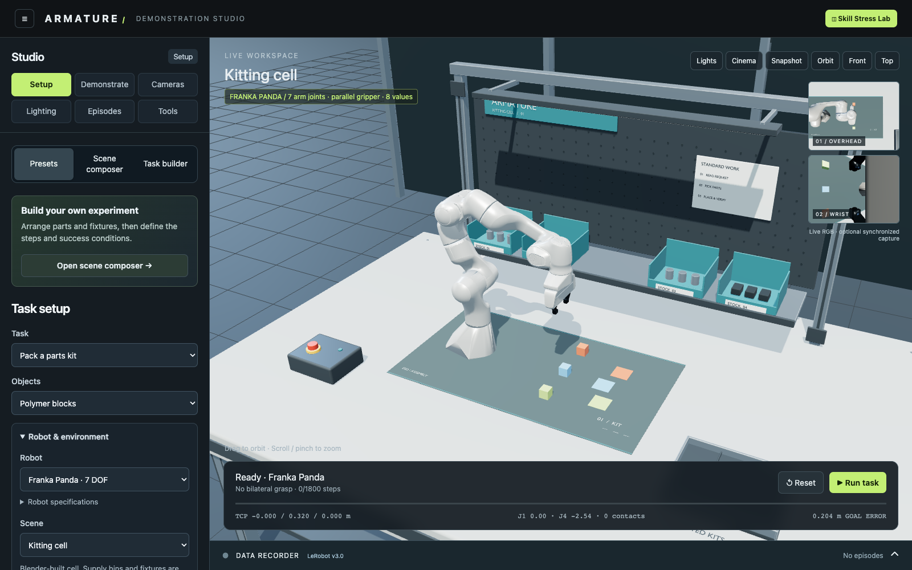

# ARMATURE

**Build a robot workspace. Teach a task. Inspect what happened.**

ARMATURE is a browser-based robotics studio for scene authoring, demonstration recording, and repeatable experiments. Set up a kitting cell, compose a pick-and-place sequence, capture camera observations, and inspect failures—all in a single self-contained page.

**[Launch the simulator →](https://arpitg1304.github.io/armature/)** · [Architecture](docs/architecture.md) · [Validation](docs/validation.md)



### From workbench to experiment

| Create | Run | Understand |
| --- | --- | --- |
| Arrange parts, targets, and fixtures with scene editing and undo. | Compose task stages or take over manually to record demonstrations. | Scrub recordings and inspect failed stress trials. |
| Choose Panda, SO-101, UR5e, or xArm 6. | Try kitting, transfer, sorting, stacking, insertion, and lighting tasks. | Compare seeded trial sweeps and reproduce individual rollouts. |
| Import static objects and configure cameras and lighting. | Export demonstrations in a LeRobot v3-style dataset layout. | Capture RGB and separate synthetic depth/instance snapshots. |

The studio opens on a **Franka Panda in a Blender-built kitting cell**; switch to SO-101, UR5e, or xArm 6 from the robot selector. Robot assets, scenery, styles, code, and simulation workers are embedded in the generated HTML. Download the page and run the core simulator offline—no application server or Blender installation required.

### Try a first task

1. [Open ARMATURE](https://arpitg1304.github.io/armature/) in a browser with WebGL enabled.
2. Choose **Kitting cell / SO-101 / Pack a parts kit** and run the task.
3. Explore **Demonstrate** to record an episode, **Cameras** to inspect observations, or **Tools** to run stress trials.
4. Change the layout or experiment settings and compare the result.

### Bookmarks and workspace views

In **Tools → Robot bookmarks**, name and save the current joint/gripper pose. Bookmarks are stored in this browser separately for each robot. **Move to pose** uses the existing kinematic servos; **Stop move** pauses it. These are joint-space moves, not collision-planned paths. Reset ended episodes before moving.

Use the **View** dropdown above the workspace to choose **Orbit**, **Front**, **Overhead**, **Gripper close-up**, or **Wide bench** to inspect the scene. **Restore view** returns to the view from before the first preset. Gripper is a snapshot of the current tool location, not a tracking camera. These controls do not change dataset cameras or recorded RGB.

### Workspace comfort

Drag the sidebar edge to resize it; double-click to restore its default width. Keyboard users can focus the divider and use arrow keys or Home. Sidebar width, visible panels, accordion sections, recorder expansion and collapsed thumbnails are remembered in this browser. Robot, task and experiment settings are not restored by this preference feature. **Tools → Reset workspace preferences** resets the layout without deleting bookmarks.

Click a workspace camera thumbnail, or **Cameras → Enlarge camera preview**, to open a larger view. Switch between overhead and wrist cameras; Escape closes it and returns focus. This magnifies existing camera pixels without increasing recording resolution.

In **Tools → Robot bookmarks**, rename the selected pose or export/import JSON for the selected robot. Imports validate the robot, joint names, units and servo limits before adding any poses. Name conflicts get an imported suffix; existing poses are never overwritten.

### Run and develop locally

Requires Node.js 22+.

```sh
npm ci
npm run build
```

Open `dist/robotics-arm-studio.html`. Edit the modules in `src/` and rebuild; the generated page contains everything needed for the core simulator.

```sh
npm test                 # source bindings, protocols, features, worker and task physics
npm run test:browser     # Chrome: simulation, authoring, sensors, recording and research tasks
npm run test:stress-ui   # Chrome: worker sweeps, export, replay and reproduction
npm run build:pages      # create _site/index.html for static hosting
npm run test:pages       # Chrome: check the deployed page layout and runtime
```

GitHub Actions runs tests and a Chromium smoke check, then deploys successful pushes to `main`. See [deployment](docs/deployment.md) for details.

### What the simulator models

ARMATURE is an experiment and authoring prototype. Default robot motion uses **velocity-limited kinematic servos with approximate collision proxies**; movable objects use Cannon-es physics. This is not a validated torque-dynamics simulator, a MuJoCo-fidelity model, or evidence of sim-to-real transfer. A separate Panda constraint-dynamics mode is experimental and unvalidated.

The kitting cell's peripheral bins and fixtures are mostly visual scenery; authored objects have separate collision approximations. Dataset exports have independent Parquet/PNG checks, but stock LeRobot loading and training remain unverified. Phone pairing needs a separate backend and phone client, which this repository does not provide.

### Research and deeper inspection

Memory tasks are hidden in the default studio. Append `?memory=1` to enable the research interface. Privileged evaluator data is kept separate from memory-policy observations, and debug overlays are excluded from recorded RGB. The general simulator API still exposes privileged state; an external policy-inference bridge is not yet implemented.

- [Architecture and observation boundaries](docs/architecture.md)
- [Kitting cell assets and Blender authoring](docs/kitting-cell.md)
- [Validation coverage and dataset checks](docs/validation.md)
- [Research directions](docs/next-improvements.md)

### License

Copyright © 2026 Arpit Gupta. ARMATURE is licensed under the [GNU General Public License v3.0 only](LICENSE) (`GPL-3.0-only`), without warranty.

Bundled dependencies and robot assets retain their own licenses and attribution requirements. The standalone page includes the application license and [third-party notices](assets/third-party-notices.json).
